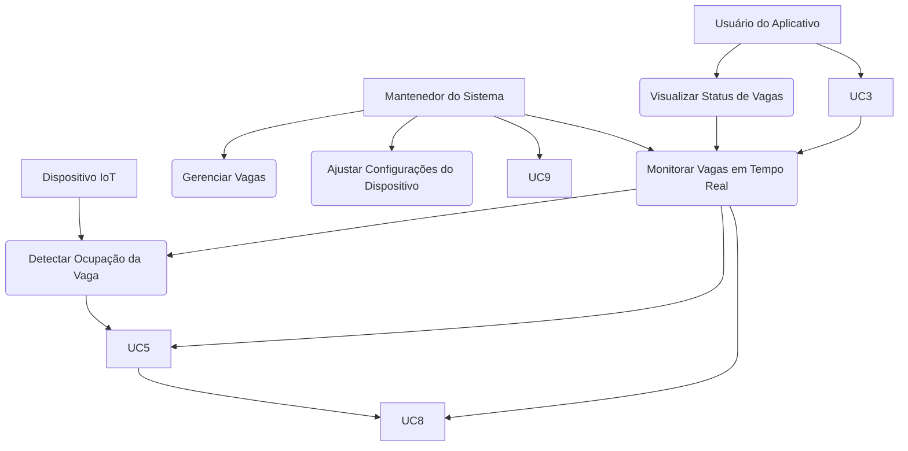

# 🅿️ Smart Space Parking - Estacionamento Inteligente

# Projeto Integrador II - TSI - IFRN - 2025
---

## 🚀 Breve Descrição

O **Smart Space Parking** é um projeto inovador focado em soluções IoT para **Smart Cities**, com o objetivo principal de otimizar a gestão de vagas de estacionamento. Nossa solução integra hardware de baixo custo, comunicação em tempo real e um aplicativo móvel intuitivo para fornecer informações precisas sobre a disponibilidade de vagas.

A fase inicial do projeto consiste no desenvolvimento de uma solução com dispositivo IoT para monitorar as vagas de um estacionamento e um aplicativo Mobile para mostrar os estados de ocupação dessas vagas. O sistema detecta o estado de ocupação de cada vaga (livre/ocupada) e transmite essa informação ao aplicativo Android para os usuários.

---

## ✨ Funcionalidades

* **Monitoramento em Tempo Real:** Detecção contínua e em tempo real do estado de ocupação de cada vaga de estacionamento.
* **Eficiência na Busca:** Usuários podem visualizar a disponibilidade de vagas em tempo real através do aplicativo móvel, economizando tempo e combustível.
* **Otimização do Espaço:** Fornece dados valiosos para a instituição sobre a utilização das vagas, permitindo melhor planejamento e gerenciamento do espaço.
* **Redução de Congestionamento:** Ao direcionar os motoristas diretamente para vagas livres, o projeto visa diminuir o tráfego e as emissões de poluentes nas proximidades do estacionamento.
* **Interface Amigável:** Aplicativo móvel com design limpo e intuitivo para uma excelente experiência do usuário.

---

## 🛠️ Resumo das Tecnologias Utilizadas

Este projeto é uma fusão de hardware e software, utilizando as seguintes tecnologias:

### Hardware (Módulo IoT)

* **Microcontrolador:** **Raspberry Pi Pico W** (integrado na BitDogLab)
    
* **Placa de Desenvolvimento:** **BitDogLab**
    * **Motivo da Escolha:** Facilita o protótipo com componentes integrados, bateria e entrada para carregamento com painel solar, ideal para autonomia e implementação em estacionamentos abertos.
* **Sensores:** **Sensores Ultrassônicos HC-SR04**
    * **Motivo da Escolha:** Detecção de presença eficaz para determinar o estado da vaga com custo baixo, ideal para o prototipo inicial. 

### Comunicação IoT

* **Protocolo:** **MQTT**
    * **Motivo da Escolha:** Leveza, eficiência e padrão publish/subscribe ideal para transmissão de dados de sensores em tempo real.

### Backend & Banco de Dados (Ainda não implementado)

* **Funções Serverless:** **Firebase Cloud Functions**
    * **Motivo da Escolha:** Atua como a "ponte" entre o broker MQTT e o banco de dados. Recebe os dados via webhook do HiveMQ e os grava no Realtime Database, sem a necessidade de gerenciar servidores.
* **Banco de Dados:** **Firebase Realtime Database**
    * **Motivo da Escolha:** Banco de dados NoSQL em tempo real, simples de usar, com um plano gratuito (Spark Plan) generoso, e excelente integração com aplicativos Flutter.

### Aplicativo Móvel

* **Plataforma de Desenvolvimento:** **Android Studio com Flutter**
    * **Motivo da Escolha:** Permite o desenvolvimento de um único código-fonte para múltiplas plataformas (Android inicialmente), com performance nativa e hot reload para agilidade no desenvolvimento.
* **SDK do Banco de Dados:** **Firebase SDK para Flutter** (Não implementado) 
    * **Motivo da Escolha:** Integração nativa e eficiente com o Firebase Realtime Database para exibição de dados em tempo real no aplicativo.

---
## 📊 Diagrama de Caso de Uso

Aqui está um diagrama de caso de uso que ilustra as principais funcionalidades do sistema e as interações entre os usuários e o dispositivo IoT.

---
## Telas 
#### Home

#### Estacionamento

#### Vagas

#### Mapa

#### Google Maps
---

## 👥 Autores do Projeto

* [Yuri Cavalcanti Aquino] - [@yuri_aquino03]
* [Manacio Pereira de Souza] - [@manacio.s]
* [Damiao Cazuza de Sousa Netto] - [@netto.s]
* [David Gabriel Macedo de Araújo ] - [@macedo.david]
* [Ronaldo dos Santos Falcão Filho] - [@ronaldo.falcao]
* [João Vitor Lopes Dos Santos] - [@vitor.lopes1]
* [Magdiel Pereira de Souza] - [@magdiel.souza]
