# 🅿️ Smart Space Parking - Estacionamento Inteligente

---

## 🚀 Breve Descrição

O **Smart Space Parking** é um projeto inovador focado em soluções IoT para **Smart Cities**, com o objetivo principal de otimizar a gestão de vagas de estacionamento. Nossa solução integra hardware de baixo custo, comunicação em tempo real e um aplicativo móvel intuitivo para fornecer informações precisas sobre a disponibilidade de vagas.

A fase inicial do projeto consiste no desenvolvimento de um protótipo para monitorar as vagas de estacionamento da instituição **IFRN**, em Natal, Rio Grande do Norte. O sistema detecta o estado de ocupação de cada vaga (livre/ocupada) e transmite essa informação para um banco de dados, que por sua vez, alimenta um aplicativo Android para os usuários.

---

## ✨ Funcionalidades

* **Monitoramento em Tempo Real:** Detecção contínua e em tempo real do estado de ocupação de cada vaga de estacionamento.
* **Eficiência na Busca:** Usuários podem visualizar a disponibilidade de vagas em tempo real através do aplicativo móvel, economizando tempo e combustível.
* **Otimização do Espaço:** Fornece dados valiosos para a instituição sobre a utilização das vagas, permitindo melhor planejamento e gerenciamento do espaço.
* **Redução de Congestionamento:** Ao direcionar os motoristas diretamente para vagas livres, o projeto visa diminuir o tráfego e as emissões de poluentes nas proximidades do estacionamento.
* **Interface Amigável:** Aplicativo móvel com design limpo e intuitivo para uma excelente experiência do usuário.

---

## 🛠️ Resumo das Tecnologias Utilizadas

Este projeto é uma fusão de hardware e software, utilizando as seguintes tecnologias:

### Hardware (Módulo IoT)

* **Microcontrolador:** **Raspberry Pi Pico W** (integrado na BitDogLab)
    * **Motivo da Escolha:** Disponibilidade, Wi-Fi integrado e suporte robusto a MicroPython/Arduino.
* **Placa de Desenvolvimento:** **BitDogLab**
    * **Motivo da Escolha:** Facilita o protótipo com componentes integrados, bateria e entrada para carregamento com painel solar, ideal para autonomia e implementação em estacionamentos abertos.
* **Sensores:** **Sensores Ultrassônicos HC-SR04**
    * **Motivo da Escolha:** Detecção de presença eficaz para determinar o estado da vaga com custo baixo, ideal para o prototipo inicial. 

### Comunicação IoT

* **Protocolo:** **MQTT**
    * **Motivo da Escolha:** Leveza, eficiência e padrão publish/subscribe ideal para transmissão de dados de sensores em tempo real.
* **Broker MQTT:** **HiveMQ Cloud (Plano Serverless Free)**
    * **Motivo da Escolha:** Broker MQTT gerenciado, gratuito para protótipos, confiável e com suporte a webhooks para integração com Cloud Functions.

### Backend & Banco de Dados

* **Funções Serverless:** **Firebase Cloud Functions**
    * **Motivo da Escolha:** Atua como a "ponte" entre o broker MQTT e o banco de dados. Recebe os dados via webhook do HiveMQ e os grava no Realtime Database, sem a necessidade de gerenciar servidores.
* **Banco de Dados:** **Firebase Realtime Database**
    * **Motivo da Escolha:** Banco de dados NoSQL em tempo real, simples de usar, com um plano gratuito (Spark Plan) generoso, e excelente integração com aplicativos Flutter.

### Aplicativo Móvel

* **Plataforma de Desenvolvimento:** **Android Studio com Flutter**
    * **Motivo da Escolha:** Permite o desenvolvimento de um único código-fonte para múltiplas plataformas (Android inicialmente), com performance nativa e hot reload para agilidade no desenvolvimento.
* **SDK do Banco de Dados:** **Firebase SDK para Flutter**
    * **Motivo da Escolha:** Integração nativa e eficiente com o Firebase Realtime Database para exibição de dados em tempo real no aplicativo.

---
## 📊 Diagrama de Caso de Uso

Aqui está um diagrama de caso de uso que ilustra as principais funcionalidades do sistema e as interações entre os usuários e o dispositivo IoT.

```mermaid
graph TD

    %% Definindo Atores como nós simples
    User[Usuário do Aplicativo]
    Admin[Mantenedor do Sistema]
    IoTDevice[Dispositivo IoT]

    %% Definindo os Casos de Uso
    UC1(Monitorar Vagas em Tempo Real)
    UC2(Visualizar Status de Vagas)
    UC3(Receber Notificações de Vaga)
    UC4(Detectar Ocupação da Vaga)
    UC5(Enviar Status da Vaga)
    UC6(Gerenciar Vagas)
    UC7(Ajustar Configurações do Dispositivo)
    UC8(Atualizar Banco de Dados)
    UC9(Acessar Relatórios de Uso)

    %% Relacionamentos
    User --> UC2
    User --> UC3

    IoTDevice --> UC4
    UC4 --> UC5
    UC5 --> UC8

    Admin --> UC6
    Admin --> UC7
    Admin --> UC9
    Admin --> UC1

    %% Inclusões (usando setas normais para maior compatibilidade)
    UC1 --> UC4
    UC1 --> UC5
    UC1 --> UC8
    UC2 --> UC1
    UC3 --> UC1
```

---

## 👥 Autores do Projeto

* [Yuri Cavalcanti Aquino] - [@yuri_aquino03]
* [] - []
* [] - []
* [] - []
* [] - []
* [] - []
* [] - []